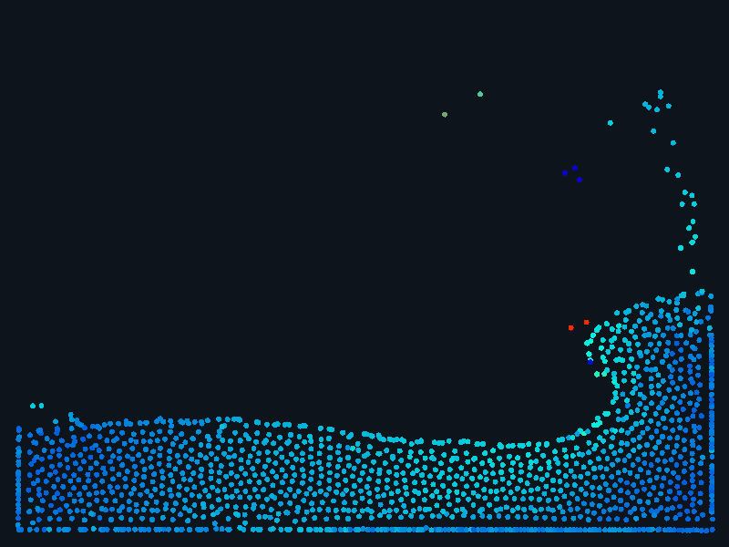

# SPH Liquid

A real-time 2D fluid simulation you can poke, tilt and splash — smoothed-particle
hydrodynamics (Müller 2003: poly6 density, spiky pressure, viscosity laplacian)
in a few hundred lines of plain JavaScript on a canvas. No framework, no build
step, no dependencies.



It's an installable PWA: offline-capable service worker, app icon, fullscreen
mode that harmonizes with the browser's own, and device-tilt gravity on
phones and tablets.

## What's inside

- `sim.js` — the physics core (UMD: browser global + Node export). Weakly
  compressible SPH with a uniform spatial-hash grid and CSR neighbour table.
  Rest density is computed from the kernel's lattice sum at rest spacing, so
  pressure at rest is exactly zero by construction.
- `index.html` — the whole UI: slide-out options panel, brush/attract/repel
  controls, live particle count and resolution knobs, palettes, metaball
  rendering.
- `test.js` — headless physics assertions (settling energy, boundaries,
  neighbour search vs brute force, "is it a fluid *body*" regression, live
  resize, resolution rescale, surface tension).
- `shots.js` / `serve.js` — deterministic PNG screenshots, zero-dependency
  dev server.
- `sw.js` / `manifest.webmanifest` / `icons/` — PWA layer.

## Run it

Open `index.html` in a browser. Or for the full experience (install, offline,
sensors):

```
node serve.js        # prints a LAN URL for your phone
node test.js         # the physics suite
node shots.js        # regenerate screenshots
```

## Tuning invariants

If you adjust things, keep these true: particle size and smoothing radius stay
in a ~2.9 ratio, the CFL number `c·dt/h` stays near 0.2, and rest density comes
from the lattice sum, never a magic number. The comments in `sim.js` explain
why each one exists — they were learned the hard way.

Keys: `Space` pause · `R` re-dam · `G` gravity · `O` options · `F` fullscreen ·
`1/2/3` render mode.
